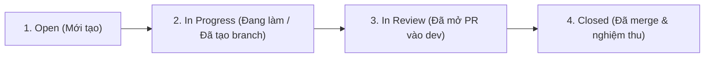

# Hướng dẫn sử dụng GitHub Issues — 2D Doodle Jump Web Project

Tài liệu này hướng dẫn các thành viên trong nhóm cách sử dụng tính năng **Issues** trên GitHub để quản lý công việc, báo lỗi, đề xuất tính năng và thảo luận kỹ thuật một cách khoa học, rõ ràng.

---

## 1. GitHub Issues dùng để làm gì?

Trong dự án của chúng ta, **Issues** đóng vai trò là bảng theo dõi công việc tập trung:
- **Báo lỗi (Bug Report):** Khi phát hiện lỗi trong game (nhân vật kẹt, rơi xuyên bệ, API lỗi, crash trình duyệt, sai điểm số...).
- **Giao việc & theo dõi nhiệm vụ (Task Tracking):** Mỗi mã công việc (như FE-01, PHYS-01, WORLD-01, BOT-01, UI-01, BE-01, LEAD-01) có thể gắn với một Issue cụ thể.
- **Đề xuất tính năng mới (Feature Request):** Đóng góp ý tưởng gameplay mới, bệ mới, vật phẩm hỗ trợ, âm thanh, hiệu ứng...
- **Thảo luận kỹ thuật (Discussion):** Trao đổi về thông số vật lý, quy ước dữ liệu, hoặc kiến trúc trước khi bắt tay vào code.

---

## 2. Các bước tạo một Issue mới

### Bước 1: Mở trang tạo Issue
1. Trên giao diện GitHub của repo `2D_Doodle_Jump_Web_Project`, bấm vào tab **Issues** (nằm cạnh tab **Code**).
2. Nhấn nút xanh lá cây **New issue** ở góc trên bên phải.

### Bước 2: Đặt tiêu đề (Title) chuẩn quy ước
Tiêu đề cần ngắn gọn, rõ ràng và có tiền tố phân loại để mọi người nhìn vào là hiểu ngay:

**Cú pháp:**
```text
[Loại][Mã việc/Module] Mô tả ngắn gọn vấn đề
```

**Ví dụ:**
- `[BUG][PHYS-01] Nhân vật rơi xuyên qua bệ khi tốc độ rơi vy lớn`
- `[BUG][BE-01] API /api/runs trả về lỗi 500 khi player_id chứa ký tự đặc biệt`
- `[FEAT][WORLD-01] Thêm bệ di động (moving platform) và bệ vỡ (fragile)`
- `[TASK][UI-01] Thiết kế màn hình Game Over và bảng xếp hạng lượt chơi`
- `[QUESTION][LEAD] Thống nhất đơn vị đo thời gian giữa engine và HUD`

---

### Bước 3: Điền nội dung mô tả (Description)

Chọn mẫu phù hợp và điền chi tiết:

#### Mẫu A: Báo lỗi (Bug Report)
```markdown
### 1. Mô tả lỗi
Mô tả ngắn gọn lỗi xảy ra là gì.

### 2. Các bước tái hiện (Steps to Reproduce)
1. Mở game tại `http://localhost:5173`
2. Nhấn phím `D` để nhảy qua bệ số 3
3. Khi nhân vật rơi với tốc độ cao thì xuyên qua mặt bệ số 4

### 3. Kết quả thực tế (Actual Behavior)
Nhân vật rơi thẳng xuống đáy màn hình mà không nảy lên.

### 4. Kết quả mong đợi (Expected Behavior)
Nhân vật phải chạm mặt bệ và nảy lên với vận tốc vy = -520.

### 5. Môi trường & Log (nếu có)
- Trình duyệt: Chrome 128 / Windows 11
- Lỗi console (nếu có): `Uncaught TypeError: ...`
- Ảnh chụp màn hình: (Dán ảnh trực tiếp vào đây)
```

#### Mẫu B: Nhiệm vụ / Tính năng mới (Task / Feature Request)
```markdown
### 1. Mục tiêu
Cần làm gì và mang lại lợi ích gì cho game.

### 2. Chi tiết thực hiện
- [ ] Viết hàm `...` trong file `...`
- [ ] Dữ liệu đầu vào: `...`
- [ ] Dữ liệu trả ra: `...`

### 3. Tiêu chí hoàn thành (Definition of Done)
- [ ] Đạt các test case trong file test `...`
- [ ] Chạy `npm.cmd test` và `npm.cmd run build` xanh
- [ ] Thử trên trình duyệt hiển thị đúng yêu cầu
```

---

### Bước 4: Thiết lập các thông tin ở cột bên phải (Sidebar)

Trước khi nhấn **Submit new issue**, hãy điền các trường ở cột bên phải:
1. **Assignees:**
   - Chọn đúng thành viên chịu trách nhiệm xử lý issue này (hoặc tự gán cho bản thân nếu bạn đang nhận việc).
2. **Labels (Nhãn):**
   - `bug`: Báo cáo lỗi code, sai logic.
   - `enhancement`: Cải tiến hoặc tính năng mới.
   - `documentation`: Cập nhật tài liệu, hướng dẫn.
   - `frontend` / `backend`: Phân vùng phạm vi kỹ thuật.
   - `help wanted`: Cần sự trợ giúp từ trưởng nhóm hoặc thành viên khác.
3. **Projects / Milestone (nếu có):**
   - Gán vào Milestone hiện tại (ví dụ: `Milestone 1: V0.0 MVP - Core Gameplay`).

### Bước 5: Bấm **Submit new issue**

---

## 3. Cách liên kết Issue với Commit và Pull Request

GitHub cho phép liên kết tự động giữa Issue và Code để tiện theo dõi:

### 1. Nhắc đến Issue trong trao đổi hoặc commit
Chỉ cần gõ dấu thăng kèm số Issue (ví dụ: `#5`), GitHub sẽ tự động tạo đường dẫn:
```bash
git commit -m "feat(world): add moving platforms (ref #5)"
```

### 2. Tự động đóng Issue khi merge Pull Request
Khi tạo Pull Request đưa code vào nhánh `dev`, hãy thêm các từ khóa đóng issue vào phần mô tả PR:
- `Closes #<số_issue>`
- `Fixes #<số_issue>`
- `Resolves #<số_issue>`

**Ví dụ trong mô tả PR:**
```text
Closes #5
Sửa hoàn thiện hệ thống bệ di động và bệ vỡ theo yêu cầu WORLD-01.
```
👉 Khi PR được Trưởng nhóm merge vào nhánh `dev`, Issue #5 sẽ **tự động được đánh dấu là Closed**!

---

## 4. Vòng đời của một Issue (Workflow)



1. **Open:** Issue vừa được tạo, chờ phân công hoặc đang trong hàng đợi.
2. **In Progress:** Thành viên nhận issue, tạo branch `feature/<tên>` từ `dev` và tiến hành code.
3. **In Review:** Đã hoàn thành code, mở PR với `base = dev` và ghi `Closes #<id>` trong mô tả PR.
4. **Closed:** PR được merge vào `dev`, issue đóng lại. Nếu là lỗi không tái hiện được hoặc trùng lặp, ghi rõ lý do trước khi bấm **Close issue**.
